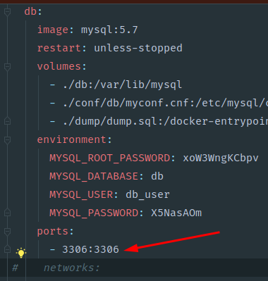
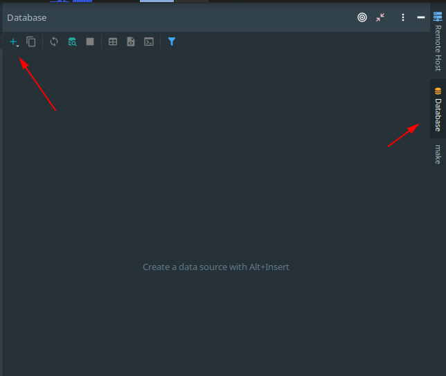
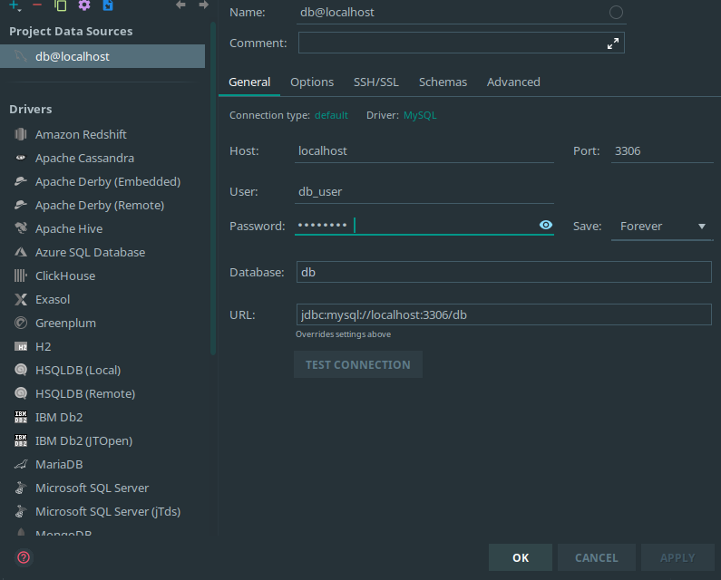
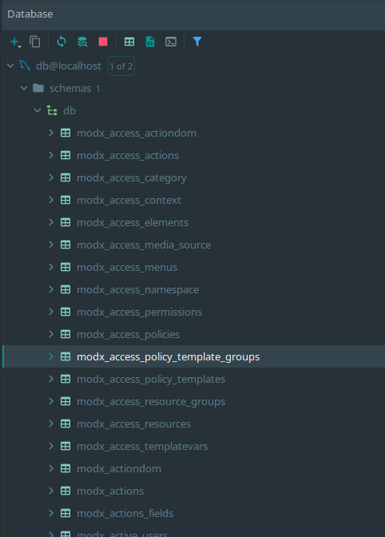
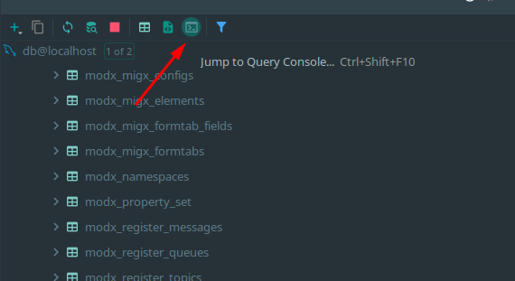

## Работаем с БД в PhpStorm и DevDocker

#### Подключение

1. Смотрим порт в docker-compose.yml, по умолчанию он равен `3306`


1. Создаем новое подключение к базе данных, выбираем
`Data Source->MySql`


1. Создаем новое подключение:
```editorconfig
host: localhost
user: db_user
database: db
password: X5NasAOm
```

и жмем "ОК"

Все, на этом этапе ваше соеденение создано и полностью
готово к работе


#### Полезности при работе с БД

1. Для поиска нужной таблици выделите любую таблицу 
и просто начните вводить название той, что хотите найти

1. Крайне советую использовать для всех запросов консоль, у phpStorm 
очень мощная система подсказок, сильно работать ручками не придется
